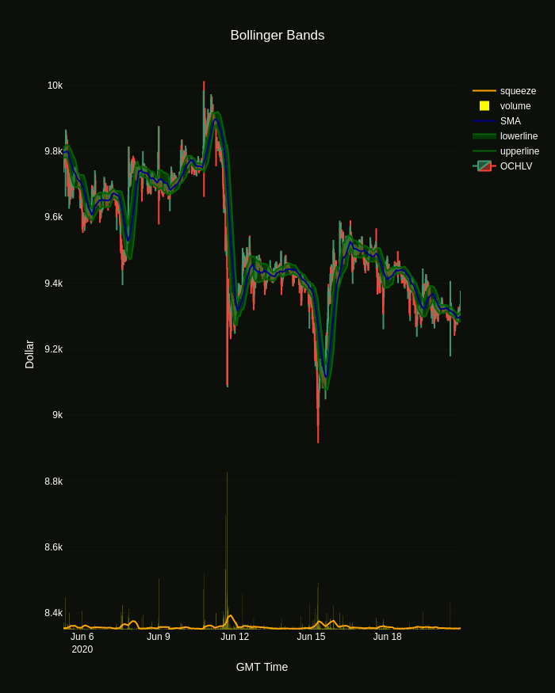

# Cryptocurrencies-TA-on-Dash 
Live Dash graphs of TA indicators on cryptocurrencies.

* Indicators:
    * Bollinger Bands
    * Ichimoku Cloud
    * Relative Strength Index
    * Simple Moving Average
    * Exponential moving average
    * Moving Average Convergence Divergence
    * Money Flow Index
    * Average True Range
    * Commodity Channel Index
    * Chaikin Money Flow
    * Normalized Least Mean Squares
    * Noise/Signal Estimator
    * Average Directional Index
    * Predictor labels*

* Functionalities:
    * Retrieves OCHLV historical data using Bitfnex RESTv2 API.
    * OCHLV candles and the derived indicators are stored in separate sqlite DBs.
    * Each indicator is computed and updated within it's own individual process. Each process is run in parallel.
    * Indicators are updated until the latest OCHLV timestamp, which is queried every few seconds.
    
* Indicator example image:



* *Predictor labels indicator description:
  The role of the labels shall be to aid in the time series prediction of future price changes by a supervised learning algorithm.
  Each label will indicate if the mean price change of future samples will exceed a certain threshold. The threshold is determined by the standard deviation of the  apriori relative price changes. 
  The algorithm is applied iteratively according to the flowchart below:


## Getting Started
```
pip install -r requirements.txt
```

## Deployment
Use update_db.py to create and/or update indicator databases:
```
python3 update_db.py
```

Use main_dash.py to run the dashboard on local server:
```
python3 main_dash.py
```

## Built With

* [Dash](https://plotly.com/dash/) - Dashboard framework
* [SQLite](https://www.sqlite.org/) - SQL database engine
* [Bitfinex API](https://github.com/scottjbarr/bitfinex) - API used to retrieve cryptocurrency OCHLV data


## License
This project is licensed under the MIT License - see the [LICENSE.md](LICENSE.md) file for details


